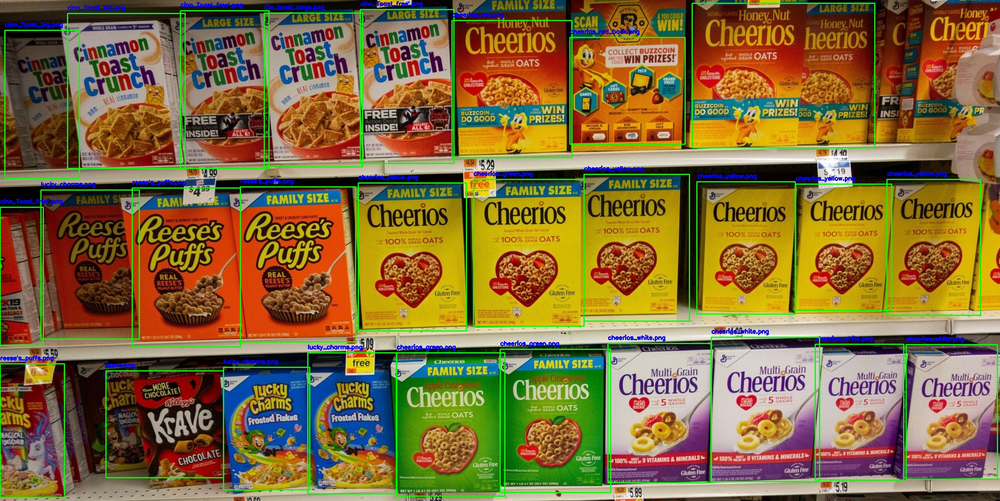

# Product-management-AI
A smart object detection for grocery stores and super markets which detectes if the products and under-stock, out of stock or misplaced.

## Detection
Detection was done by fine tuning a pre-trained YOLOv8 model on a 110k SKU dataset, which gave it capabilities to achieve 98% accuracy on detecting any type of product

## Classification
Classification was optimized by extracting the flattened feature vector using Inceptionv3 CNN model and comparing it with sorted feature vectors dictionary of the inventory.

## Rack identification
the average of the maximum and minimum limit of the product will create a dictionary of the limits and the products will be added to this dictionary based on the center coordinates. which also saves the process of seperately trainig of rack identification

### processed Image:

## Author
Kaushal G / @kaushalg47

